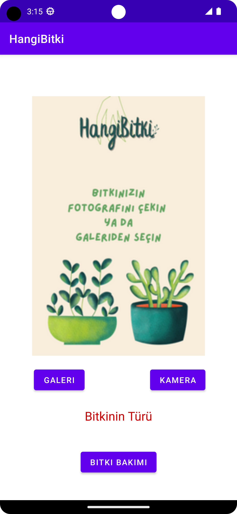
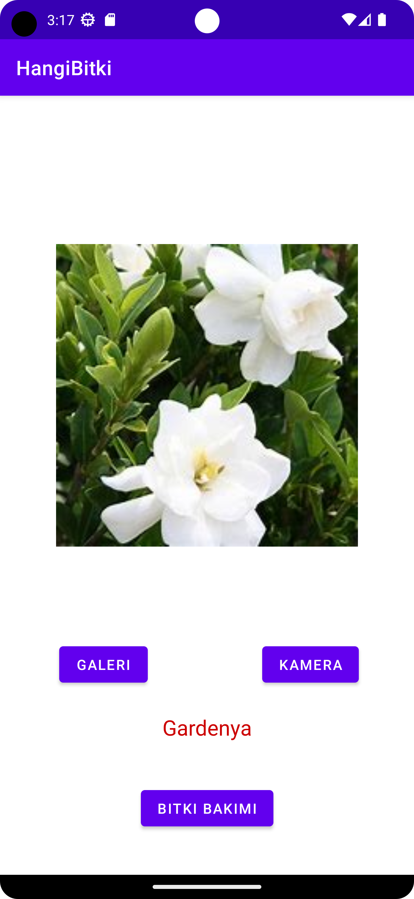

# HangiBitki

An Android application that identifies plant species from images and provides care recommendations using a custom-trained deep learning model. The application uses a CNN-based image classification model developed with TensorFlow and Keras. A custom dataset containing 50 plant categories was created and used for training. The trained MobileNetV2 model was converted to TensorFlow Lite and integrated into the Android application for offline plant recognition.

## Features

- Identify plant species using camera images or gallery photos
- Offline AI-powered plant recognition
- Provide plant care recommendations
- Custom-trained image classification model
- Mobile deployment of a TensorFlow Lite model

## Machine Learning Workflow

- Collected and curated a custom dataset of approximately 5,000 plant images across 50 categories
- Cleaned and preprocessed images, then split the dataset into training, validation, and test sets
- Trained a CNN-based image classification model using MobileNetV2 with TensorFlow and Keras
- Evaluated model performance using test data
- Converted the trained model to TensorFlow Lite for mobile deployment
- Integrated the TensorFlow Lite model into an Android application

## Technologies

### Mobile Application
- Kotlin
- Android SDK
- AndroidX
- TensorFlow Lite

### Machine Learning
- Python
- TensorFlow
- Keras
- MobileNetV2
- OpenCV
- NumPy
- Matplotlib
- Google Colab

## Model Performance

- Plant categories: 50
- Test accuracy: ~70%

## Screenshots

  
  
  

