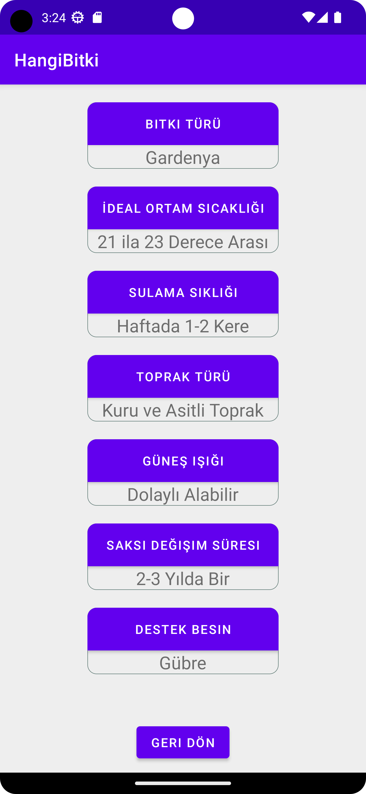

# HangiBitki

## Plant Recognition Android Application

## Description

An Android application that identifies plant species from images and provides care recommendations using a custom-trained AI model. The model was trained with a custom dataset using TensorFlow and Keras, then integrated into the Android application.

## Features

- Identify plant species using camera images or uploaded photos
- Provide plant care information based on classification results
- AI-powered image classification
- Custom-trained machine learning model integration

## Technologies

- Kotlin
- Android SDK
- TensorFlow
- Keras
- Python
- Machine Learning
- Deep Learning
- Computer Vision
- Image Classification

## Machine Learning Workflow

- Created and prepared a custom dataset
- Trained an image classification model using TensorFlow and Keras
- Evaluated the model performance
- Integrated the trained model into an Android application

## Screenshots

  
  
  

